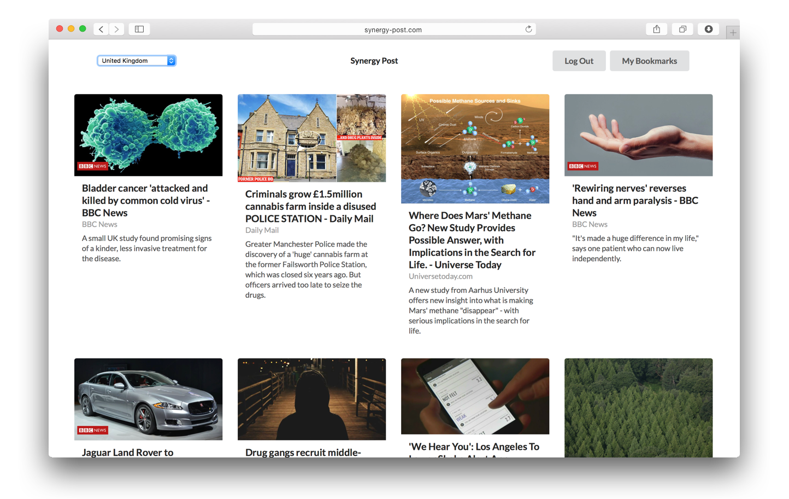
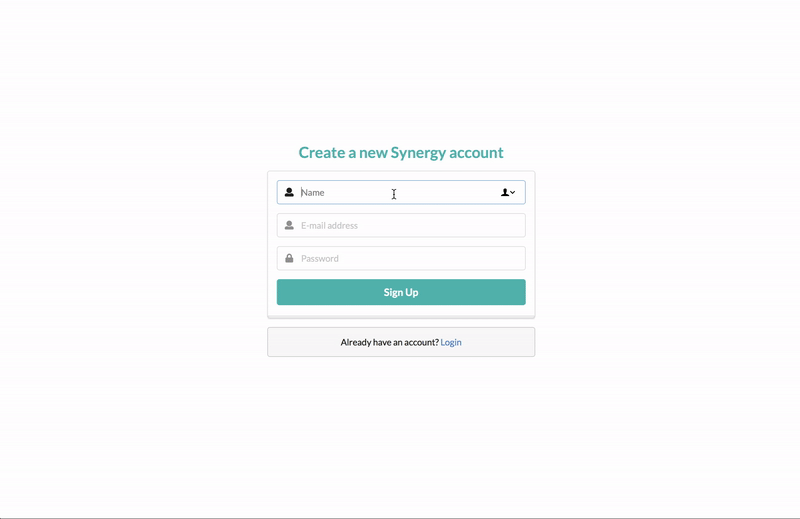

# Synergy-Post

> News aggregrator app built out of <a target="_blank" href="https://github.com/eeeeoo/Synergy-Post-Backend">Rails backend</a>, React front-end, <a target="_blank" href="https://newsapi.org/"> Google News API, and Semantic UI React

#### Synergy-Post is a news aggregrator app I collaborated with two developers. The app pulls articles from all over the world, using the Google News API. Depending on your language preferences, you can choose to see local news from 54 countries.The top headlines are only available for a month, but you can bookmark your articles. 



## Installation
```sh
1. cd Synergy-Post-Backend
2. run `rails s -p 3001`
3. open a second tab in your terminal
4. cd Synergy-Post
5. run npm start
6. it will ask if you want to run on a different port other than port 3000 currently hosting your rails server
7. Y for yes
8. Site should be accessible on `http://localhost:3000/` if you have no other apps running in the background.
```
## Demo

**1. Login (Auth)**

The app allows the user to register and/or login to an account and makes sure the account information is correct.




**2. Global News**

The user can read articles from 54 countries and save articles for later. 


**3. Bookmarks**

The user can sign back into see saved bookmarks. 


## Release History
* 0.1.0
    * First official release

## Meta

* **Jee Yoon Lee** – [github.com/eeeeoo](https://github.com/eeeeoo)

* **Sree Mudunuri** – [github.com/sreemudunuri] (https://github.com/sreemudunuri)

* **Michael O'Brien**


## Contributing

1. Fork it (<https://github.com/eeeeoo/ram-frontend/fork>)
2. Create your feature branch (`git checkout -b feature/fooBar`)
3. Commit your changes (`git commit -am 'Add some fooBar'`)
4. Push to the branch (`git push origin feature/fooBar`)
5. Create a new Pull Request

